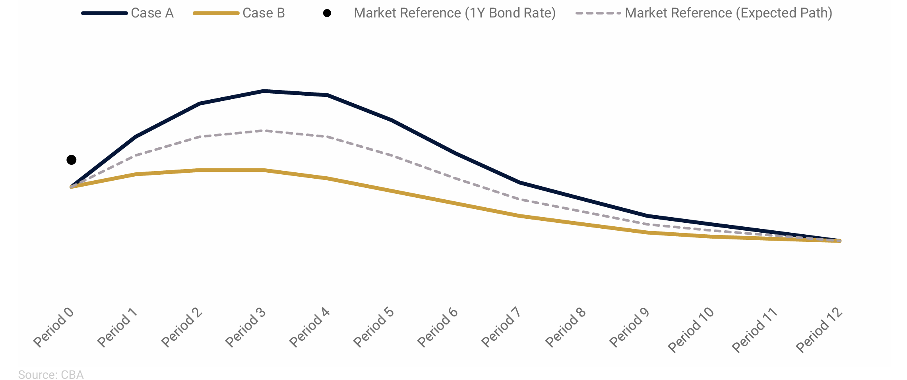

# ENDOCRED Model Simulations

ENDOCRED (Endogenous Credibility) is a macroeconomic modeling framework that explicitly incorporates **credibility dynamics** into monetary policy decisions. It is widely used at central banks around the world, and in particulat, at the central banks that adopted prudent risk-management approach to monetary policy (FPAS MARK II) for forecasting and policy analysis.

---

## Brief Introduction to ENDOCRED

**Why ENDOCRED?**

- Traditional FPAS models assume **fixed policy credibility**, often unrealistic during uncertain periods.
- ENDOCRED addresses this by allowing **public trust in the central bank to evolve endogenously** over time.
- It is especially relevant in contexts like **post-pandemic inflation**, where expectations, communication, and policy strength interact nonlinearly.

---

## Key Features of the ENDOCRED Framework

- **Endogenous Credibility Process**: Expectations react dynamically to how well the central bank achieves its objectives.
- **Two Inflation Regimes**:
  - A credible regime (expectations anchored at 2%)
  - A high-inflation regime (persistent, drifting expectations)
- **Nonlinear Phillips Curve**: The effect of output gaps on inflation intensifies in high-pressure economies.
- **Loss Function Approach**: The model minimizes a central bank’s loss function instead of assuming a fixed interest rate rule.
- **DynareJulia Implementation**: Fully implemented in open-source tools for fast policy simulation and transparency.

---

## Policy Simulations and Scenarios

The model supports scenario-based decision-making using cases such as:

- **Case A (Hawkish)**: Persistent inflation, requires strong policy tightening.
- **Case B (Dovish)**: Inflation is transitory, calls for mild adjustment.
- **Case X (Tail Risk)**: Stagflation or geopolitical shocks.

**Alternative Paths for the Policy Rate**



---

## Credibility Metrics

The framework introduces two empirical indicators:

- **CBSPII**: Central Bank Sticky Price Inflation Indicator (e.g., based on Atlanta Fed sticky CPI)
- **CBCSI**: Central Bank Credibility Stock Index

These help calibrate credibility loss and track its macroeconomic effects.

---

## Key Takeaways

- **Credibility is a dynamic asset**, not a fixed assumption.
- **Delays in tightening** can lead to **self-fulfilling inflation traps**.
- Models must account for **expectation shifts** in response to communication and action.
- ENDOCRED helps to think about and model “dark corners” of monetary policy — such as stagflation, delayed disinflation, or excessive tightening.

---

> 📖 _"In times of incredible uncertainty... a failure to act quickly, aggressively, and flexibly can lead to a very costly loss of credibility."_  
> — _Kostanyan et al., 2022_

---

## Simple Linear ENDOCRED

These are the model and script files:

- [`simple_linear.mod`](models/simple_linear.mod)
- [`simple_linear.jl`](models/simple_linear.jl)


## FPAS MARK II Scenarios - Model Codes in DynareJulia 

These are the model and script files:

- [`MARKET_2025Q1.mod`](models/MARKET_2025Q1.mod)
- [`Case_A_2025Q1.mod`](models/Case_A_2025Q1.mod)
- [`Case_B_2025Q1.mod`](models/Case_B_2025Q1.mod)
- [`SCENARIOS_2025Q1.jl`](models/SCENARIOS_2025Q1.jl)

Download them and place all four in the same project directory.

### Application: Not The Fed Tealbook, April 2025

  [Download here](images/us_report_250519_nttb.pdf)

---

## ▶️ How to Run

1. Activate your project environment (or create one):

```julia
using Pkg
Pkg.activate("venv")  # or your preferred environment path
```


## Key References

The following academic and policy-oriented references are essential to understanding the theoretical foundation of ENDOCRED, credibility-driven forecasting, and risk-based monetary policy.

- **Laxton, D., Galstyan, M., & Avagyan, V. (2024)**  
  *Prudent Risk Management Approach to Monetary Policy*  
  Central Bank of Armenia, forthcoming.
  [Download here](https://www.thebetterpolicyproject.org/_files/ugd/bf672a_44316592afd24e26add8648beeb507a2.pdf)

- **Adrian, T., Laxton, D., & Obstfeld, M. (Eds.) (2018)**  
  *Frontiers of Monetary Policy Making*  
  International Monetary Fund.
  [Download here](https://www.thebetterpolicyproject.org/_files/ugd/bf672a_8de64ff0b60b4b5b84ce827b82627fe8.pdf)

  - **Kostanyan, A., Matinyan, A., & Papikyan, A. (2022)**  
  *Getting FIT with Imperfect Policy Credibility 
  DYNARE/JULIA Workshops with an Application for the US  Economy (2022)*
  Central Bank of Armenia.
  [Download here](https://www.thebetterpolicyproject.org/_files/ugd/bf672a_9c8ffebeb3fd4a4089dd58df49912efc.pdf)

  - **Kostanyan, A., Matinyan, A., & Papikyan, A. (2022)**  
  *Getting FIT with Imperfect Policy Credibility:
  DYNARE/JULIA Workshops with an Application for a Small Open Economy*
  Central Bank of Armenia.
  [Download here](https://www.thebetterpolicyproject.org/_files/ugd/bf672a_8367dd41c9bf4293af461464187ad2a1.pdf)

- **Laxton, D., Igityan, H., & Mkhatrishvili, S. (2024)**  
  *Adapting Monetary Policy Frameworks for Risk Management*  
  Forthcoming in the **Oxford Review of Economic Policy**.
  [Download here](https://www.thebetterpolicyproject.org/_files/ugd/bf672a_de842ff248ea4351b5c31b172e3fca22.pdf)

- **Clinton, K., Hlédik, T., Holub, T., Laxton, D., & Wang, H. (2017)**  
  *Czech Magic: Implementing Inflation-Forecast Targeting at the CNB*  
  IMF Working Paper 17/21.
  [Download here](https://www.imf.org/en/Publications/WP/Issues/2017/01/20/Czech-Magic-Implementing-Inflation-Forecast-Targeting-at-the-CNB-44604)

- **Laxton, D., Freedman, C., Kumhof, M., Laxton, J., Muir, D., Mursula, S., & Wang, H. (2015)**  
  *Adding the Exchange Rate as a Tool to Combat Deflationary Risks in the Czech Republic*  
  IMF Working Paper 15/74.
  [Download here](https://www.imf.org/en/Publications/WP/Issues/2016/12/31/Adding-the-Exchange-Rate-as-a-Tool-to-Combat-Deflationary-Risks-in-the-Czech-Republic-42771)

- **Greenspan, A. (2003)**  
  *Monetary Policy under Uncertainty*  
  Jackson Hole Symposium Speech. 
  [Download here](https://www.federalreserve.gov/boarddocs/speeches/2003/20030829/default.htm)

- **Bernanke, B. (2024)**  
  *Forecasting for Monetary Policy Making and Communication: A Review*  
  Bank of England. 
  [Download here](https://www.bankofengland.co.uk/independent-evaluation-office/forecasting-for-monetary-policy-making-and-communication-at-the-bank-of-england-a-review)

---

**Further Reading & Transparency Reports**  
- [The Better Policy Project – Research Papers](https://www.thebetterpolicyproject.org/research-papers)  
- [Central Bank of Armenia – Transparency Report Q4 2024](https://www.cba.am/EN/pmessagesannouncements/Transparency_Report_Q42024_Eng.pdf)


## 🎥 Video Tutorials

Check out ENDOCRED framework in action through a full video lecture series and real-world applications.

<style>
.video-grid {
  display: flex;
  flex-wrap: wrap;
  gap: 20px;
}
.video-grid .video {
  flex: 1 1 calc(50% - 20px);
  box-sizing: border-box;
}
.video-grid img {
  width: 100%;
  height: auto;
  border-radius: 6px;
}
.video-grid h4 {
  margin: 10px 0 5px;
}
</style>

<div class="video-grid">

<div class="video">
  <a href="https://www.youtube.com/watch?v=dA45w1VwkVk" target="_blank">
    
  </a>
  <h4>The Endogenous Policy Credibility Model</h4>
</div>

<div class="video">
  <a href="https://www.youtube.com/watch?v=0Q_XUtJMMoM" target="_blank">
    
  </a>
  <h4>Real-World Applications of ENDOCRED</h4>
</div>

<div class="video">
  <a href="https://www.youtube.com/watch?v=MCWz0ABu_Z0" target="_blank">
    
  </a>
  <h4>ENDOCRED - Abstract</h4>
</div>

<div class="video">
  <a href="https://www.youtube.com/watch?v=vyG-wxkkhzA" target="_blank">
    
  </a>
  <h4>1. Introduction</h4>
</div>

<div class="video">
  <a href="https://www.youtube.com/watch?v=rmi8G5gJgcU" target="_blank">
    
  </a>
  <h4>2. Development of Credibility-Focused Models</h4>
</div>

<div class="video">
  <a href="https://www.youtube.com/watch?v=UHr-JwT5NLE" target="_blank">
    
  </a>
  <h4>3. The Multi-Country Gap Model</h4>
</div>

<div class="video">
  <a href="https://www.youtube.com/watch?v=6a96GlKfjI0" target="_blank">
    
  </a>
  <h4>4. Non-linear ENDOCRED</h4>
</div>

<div class="video">
  <a href="https://www.youtube.com/watch?v=DBGw12gKOwA" target="_blank">
    
  </a>
  <h4>5. The Future of Monetary Policy Frameworks</h4>
</div>

<div class="video">
  <a href="https://www.youtube.com/watch?v=s4DaZzjYdrM" target="_blank">
    
  </a>
  <h4>6. FPAS MARK II and ENDOCRED</h4>
</div>

<div class="video">
  <a href="https://www.youtube.com/watch?v=tMxe1iAepks" target="_blank">
    
  </a>
  <h4>ENDOCRED Handbook – Conclusion</h4>
</div>

</div>

