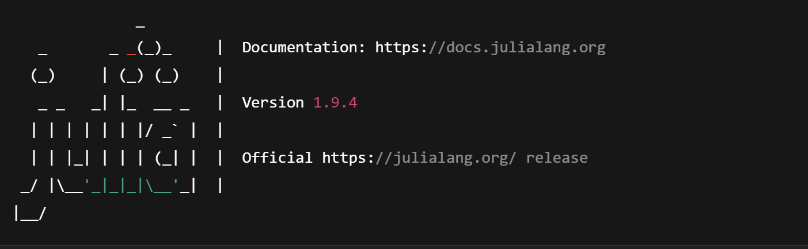

# Getting Started with DynareJulia

This section will walk you through installing **Julia** — the foundational language for running DynareJulia.

---

## Step 1: Download Julia

DynareJulia currently requires **Julia version 1.9.4** for compatibility and performance reasons.

> 🛠️ You must install **version 1.9.4**, not the latest version.

To download it:

👉 Visit the [Julia Old Releases Page](https://julialang.org/downloads/oldreleases/)

Then scroll down to find: 
Version 1.9.4 (released on 2023-12-21)

Select the appropriate installer based on your operating system:

### 💻 For Windows
- Click on: `julia-1.9.4-win64.exe` (or `julia-1.9.4-win32.exe` if using 32-bit)
- Run the installer
- Accept default settings (you can check “Add Julia to PATH” if available)

### 🍎 For macOS
- Click on: `julia-1.9.4-mac64.dmg`
- Open the `.dmg` file and drag **Julia** into your `Applications` folder

### 🐧 For Linux
- Download the `julia-1.9.4-linux-x86_64.tar.gz`
- Extract it using your terminal

## Step 2: Testing

  

